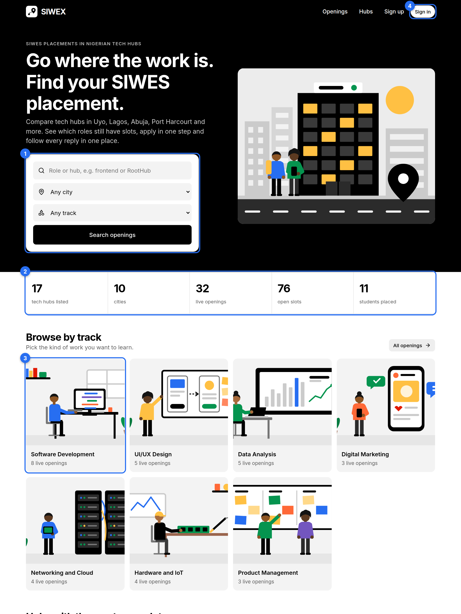

# SIWEX

Find SIWES placements in tech hubs in Uyo and across Nigeria. Students search hubs, apply in one step and track replies. Hubs post openings, accept or reject applicants and follow their interns week by week.

Live: https://siwex-production.up.railway.app



## Demo logins

| Role | Email | Password |
| --- | --- | --- |
| Student | imaobong@siwex.ng | demo1234 |
| Hub (Start Innovation Hub) | start@siwex.ng | demo1234 |

The sign-in page fills these in for you. Use the "Hub demo" tab to switch.

## Features

- 17 tech hubs in 10 cities: Futtybills, Start Innovation Hub, The RootHub, Square One and Chainspace HQ in Uyo, plus KodeHauz (Eket), Co-Creation Hub and Leadspace (Lagos), Ventures Park (Abuja), Wennovation Hub (Ibadan), CoLab (Kaduna), Roar Nigeria Hub (Enugu), Harvoxx and SpaceTrax (Port Harcourt), Ilorin Innovation Hub, Guru Innovation Hub and Lift Hub (Calabar).
- Hub directory with keyword, city and track filters and one-tap city chips. An openings page lists every live role, closest deadline first.
- Uber-style look: black and white, Inter type, flat illustrations made for the project, generated geometric hub logos and procedural city skylines. No images are loaded from outside servers.
- Opening status worked out from the deadline and accepted count: Open, Closing soon, Full, Closed.
- Apply with a short note. The app blocks closed or full openings, duplicates, more than 3 pending applications, a second placement, and placements shorter than the student's SIWES.
- Student dashboard with application status, a warning when a hub has not replied in 10 days, ranked recommendations and placement progress.
- Hub dashboard with stats, accept or reject, intern progress bars and a form to post new openings.
- Zod validation with inline field errors on every form.
- Email and password auth with bcryptjs and a signed JWT in an HTTP-only cookie.
- Works on phones: single column layout, no sideways scrolling.

## Quick start

```bash
service postgresql start
sudo -u postgres createdb siwex
sudo -u postgres createdb siwex_test
cp .env.example .env      # edit DATABASE_URL and TEST_DATABASE_URL if needed
npm install
npm run db:migrate
npm run db:seed
npm run dev               # http://localhost:3000
```

Set `SIWEX_TODAY=YYYY-MM-DD` to pin "today" for a repeatable demo. Seed data is dated relative to today.

## Scripts

| Script | What it does |
| --- | --- |
| `npm run dev` | Development server |
| `npm run build` / `npm start` | Production build and server |
| `npm run typecheck` / `npm run lint` | TypeScript and ESLint |
| `npm run db:generate` | New SQL migration from schema changes (drizzle-kit) |
| `npm run db:migrate` | Apply migrations |
| `npm run db:seed` | Wipe and reseed demo data |
| `npm run db:seed:if-empty` | Seed only when the database has no users (used on Railway) |
| `npm test` | Vitest unit and integration tests (needs `TEST_DATABASE_URL`) |
| `npm run test:e2e` | Playwright tests on desktop and mobile against a production build |
| `npx tsx scripts/gen-illustrations.ts` | Regenerate the SVG illustrations in `public/illustrations/` |
| `npm run docs:build` | Rebuild `docs/SIWEX-Documentation.pdf` and `docs/SIWEX-Slides.pdf` (run `npm run build` first) |

## Tests

- 41 unit tests (rules, dates, validation, sessions)
- 21 integration tests against a real Postgres test database
- 19 Playwright end-to-end tests (15 desktop, 4 mobile)

## Stack

Next.js 16 (App Router, Server Components, Server Actions), TypeScript strict, Drizzle ORM and PostgreSQL, Zod, bcryptjs, jose, lucide-react, DiceBear, Fontsource (Inter), Vitest, Playwright. Deployed on Railway.

## Project layout

```
src/lib/rules.ts       business rules as pure functions (take "today" as input)
src/lib/data.ts        database reads and writes, scoped to the signed-in user
src/lib/validation.ts  Zod schemas
src/app/               pages, Server Actions, /api/health
src/db/                Drizzle schema, connection, seed data
drizzle/               SQL migrations
docs/                  documentation PDF, slides PDF, screenshots and generator scripts
```

## Documentation

- [docs/SIWEX-Documentation.pdf](docs/SIWEX-Documentation.pdf): overview, logic, architecture, screen walkthrough, mobile, setup, testing, deployment and a 5 minute presentation script.
- [docs/SIWEX-Slides.pdf](docs/SIWEX-Slides.pdf): 10 slide deck for the presentation.
